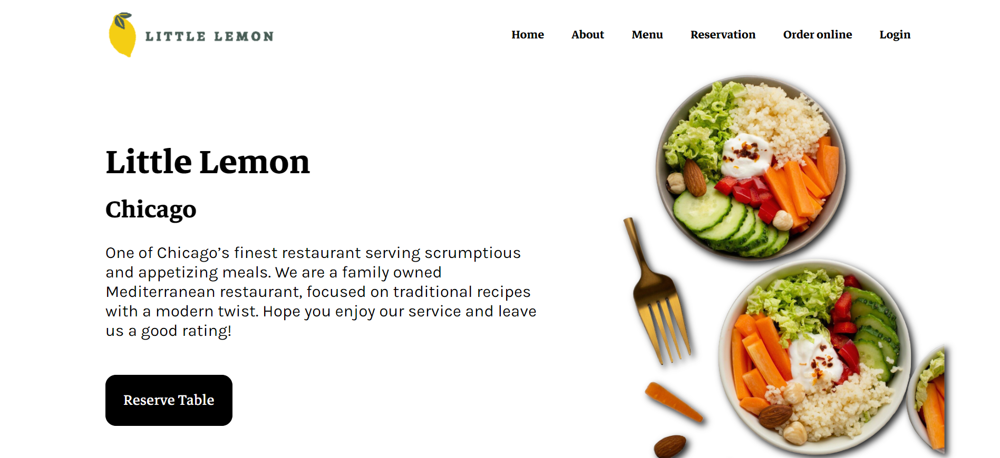
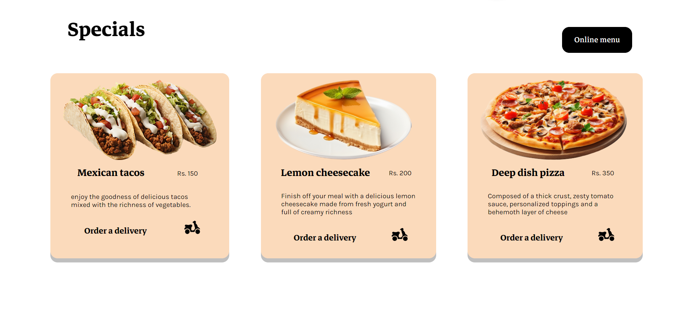
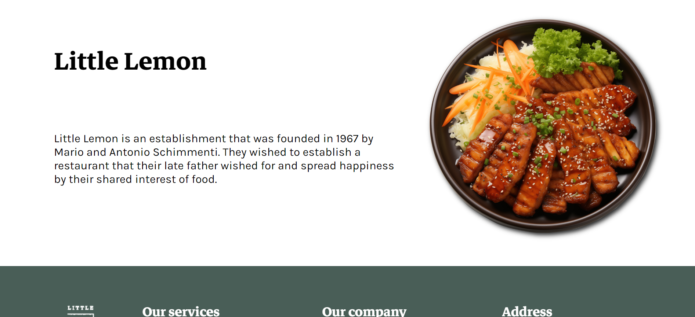
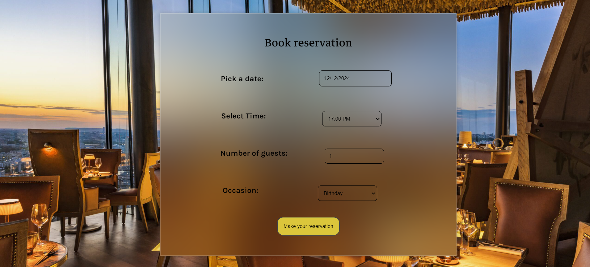
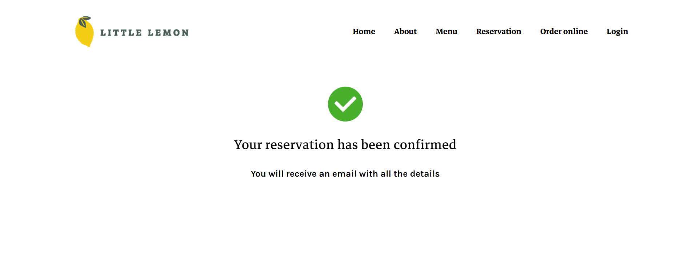

# Little Lemon restaurant reservation site

This website is part of Meta's front end capstone project. The main issue faced by Little Lemon was that it was receiving negative feedback from it's customers regarding the reservation booking component of their site. This aims to solve that problem by implementing tests and making server side api more refined.

The site can be viewed here : https://lemon-restaurant.vercel.app/

Here are a few screenshots from the project :

home page :

specials provided by the restaurant :

About the restaurant :

Reservation component :

Confirmation regarding the reservation :

